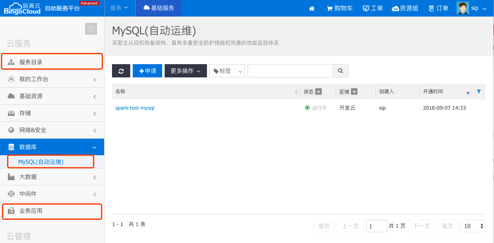

### 自助服务门户
* **服务目录**：统一展现平台对用户提供的服务能力的入口。

  

  ​

* **服务实例**：用户申请到的服务实例，通常是一组资源的组合。

  * Mysql : 例如用户申请Mysql服务后得到的MySQL环境实例需要在自助服务门户中管理。

> 自动化部署类型的服务，发布时，会在自助门户中创建对应的列表菜单。
>
> 业务应用类型的应用，由于数量较多，统一归类到业务应用菜单中进行展示

### 配置管理-高级服务

* **服务管理**：对服务目录中服务的创建、修改、发布和下架等管理
* **部署方案**：以应用为单位管理部署方案，应用->版本->方案
* **方案测试**：设计应用的过程中，管理部署出来的环境实例，也可以管理已发布的服务创建出来的环境实例
* **部署任务**：对自动化部署服务运行的任务的进度，日志等进行查看
* **文件管理**：提供一个软件包管理的功能
  * 临时文件：用户上传的文件，属于临时文件，只有用户可见
  * 仓库文件：将文件注册到仓库后，平台会帮助分发到多区域环境，并存入中心仓库，供安装下载使用
* **流程引擎**：SipRS引擎相关的模型和流程实例管理
  * 执行器：平台中各服务单元的展示信息
  * 流程模型：对于存储在SipRS中的所有流程模型统一管理
  * 流程实例：对于SipRS中运行的所有流程实例统一管理