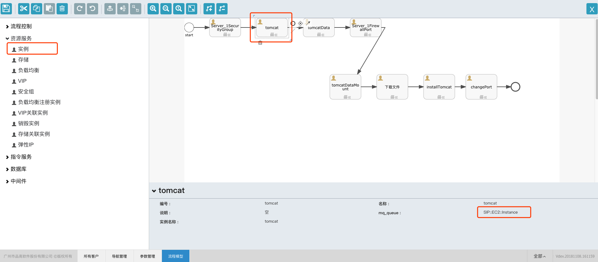

实例是一键交付服务的重要组成，是指令运行的承载，是应用拓扑视图中的重要一环。

### 实例交付

>  SIP::EC2::Instance,交付一台云主机

在设计器中，从资源服务中拖动实例到主面板。

* 编号是BPMN中元素的唯一标识，不允许写入中文。
  * 在实例创建的场景中，编号同样也是云主机的编号，譬如Host解析。
  * 在`SipRS`的框架中，要通过编号获取输出信息，例如`${outputs.javaAppServer.instanceId}`。

> 关于如何获取输出信息，请参看https://siprs-doc.github.io/designer/modelDesigne.html

* mq_queue是每个执行器的唯一标识
* 实例名称，是虚拟机的名称，如果为空，则默认取名称字段
* 编号，名称，描述都是BPMN自己的元素，每个执行器都会有

实际上创建一台云主机，一定不止有名称和编号这两个参数，还会包括镜像，实例规模，密钥，网络等，如下图所示：

因为这些参数，大多都需要在部署服务的时候，由用户选择，所以系统初始化的时候，会设置为不显示在设计器中。

输出信息：

| 名称           | 显示名称        |
| ------------ | ----------- |
| privateIp    | 私有IP        |
| instanceCode | 实例编号：i-xxxx |
| instanceId   | 实例ID，UUID   |

### 销毁实例

> SIP::EC2::Instance::Terminate，销毁一台云主机

销毁实例的参数如下：

| 名称           | 显示名称 |
| ------------ | ---- |
| regionId     | 区域ID |
| instanceCode | 实例编号 |
| instanceId   | 实例ID |

使用实例ID，或者使用区域+编号的组合，可以唯一确定一台虚拟机，进行销毁操作。

