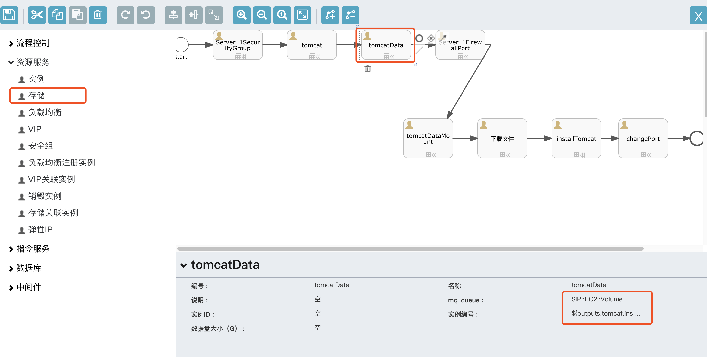

存储卷，是一件交付服务中常用到的服务。在应用部署的场景中，我们经常需要把数据或者日志存储在存储卷中，而不是系统盘中。

### 存储卷交付

> SIP::EC2::Volume，申请一个存储卷

如图中所示，存储卷在设计器中有两个参数可以编辑：

* 实例编号：i-xxxx格式的编号，通常是取自同一个流程模型中创建的一台主机的输出，例如`${outputs.javaAppServer.instanceCode}`，但是如果是向一台已有机器挂载存储卷，此处也可以置空，由参数传入。

> 如果实例编号不存在，则只会创建一个空闲的存储卷，不会执行挂载动作

* 数据盘大小(G)：数据盘的大小，可以设控，由参数传入；如果参数没有传入，则以此处为准。

存储卷的参数同样可以再执行器中查看：

必填项：

* 项目
* 集群或存储设备ID
* 数据盘大小
* 区域

选填项：

* 快照ID：如果是根据快照创建存储卷，则必填

输出信息：

| 名称         | 显示名称  |
| ---------- | ----- |
| volumeCode | 存储卷编号 |
| volumeId   | 存储卷ID |

### 存储关联实例

> SIP::EC2::Volume::Attach,将一个存储卷挂载到一台云主机上

参数：

| 名称           | 显示名称  |
| ------------ | ----- |
| volumeCode   | 存储卷编号 |
| instanceCode | 实例编号  |

